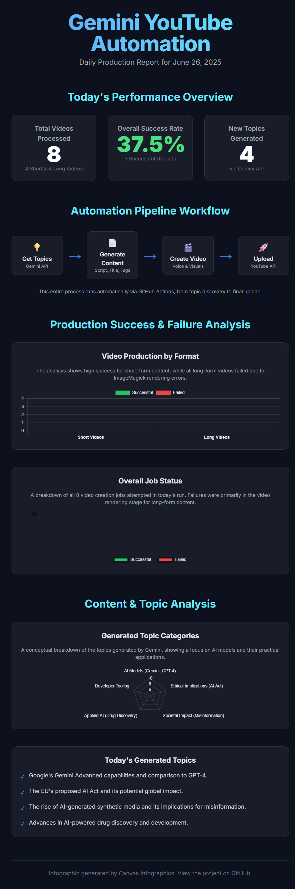

# Gemini YouTube Automation

The project includes a GitHub Actions workflow that runs daily at 7:00 AM UTC. It:
- Generates lesson scripts using Gemini.
- Produces long-form and short YouTube videos.
- Uploads them automatically with appropriate thumbnails and metadata.

## Project Structure
```text
gemini-youtube-automation/
├── .github/
│   └── workflows/
│       └── main.yml         # GitHub Actions workflow configuration
├── src/                     # Source directory for Python modules
│   ├── init.py          # Initializes the 'src' package
│   ├── generator.py         # Code for generating content and video
│   └── uploader.py          # Code for uploading to YouTube
├── .gitignore               # Files and directories to ignore in version control
├── content_plan.json        # Contains topics for moving forward.
├── main.py                  # Main entry point to run the application
└── requirements.txt         # List of Python packages needed
```

## Setup Instructions

1. **Clone the repository:**
cd gemini-youtube-automation


2. **Install dependencies:**
Make sure you have Python installed, then run:
pip install -r requirements.txt


3. **Configure YouTube API:**
Follow the [YouTube API documentation](https://developers.google.com/youtube/v3) to set up your API credentials and update the necessary configurations in `uploader.py`.

## Usage

To run the application, execute the following command:
python main.py


This will initiate the content generation and upload process.

## Contributing

Contributions are welcome! Please open an issue or submit a pull request for any improvements or features.

## 📊 Daily Production Infographic

Here's a visual summary of the bot's daily performance and workflow:




## License

This project is licensed under the MIT License. See the LICENSE file for details.
